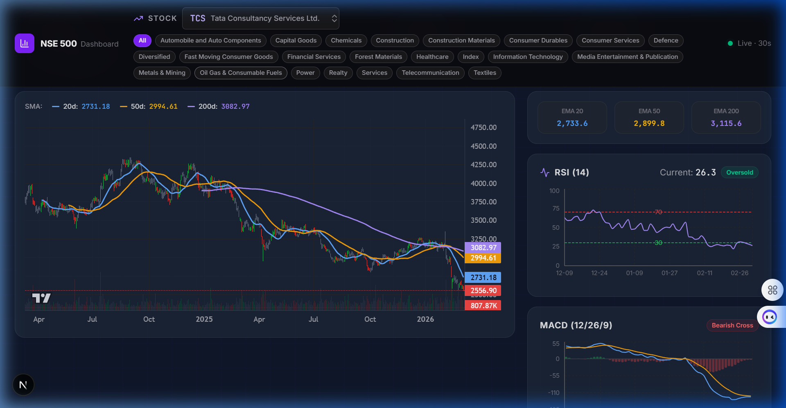

# NSE 500 FinceptTerminal

> A professional, real-time Indian stock market intelligence dashboard — built with Next.js 15, FastAPI, and AI-powered quantitative analysis.


---

## 📷 Visual Preview


*Professional Dark Mode Dashboard with SMA/EMA Price Overlays and Technical Indicators*

---

## ✨ Advanced Features

| Feature                 | Description                                                                 |
| ----------------------- | --------------------------------------------------------------------------- |
| ⚡ **VCP & RS Scan**    | Minervini-style Volatility Contraction Pattern scanner with RS scoring.     |
| 📦 **Commodities**      | Native support for global commodities (GC=F, SI=F, CL=F).                   |
| 🎯 **Pivot Levels**     | Automated Standard Pivot Point calculation (P, R1, R2, S1, S2).             |
| 📈 **WMA 44 & Momentum**| Specific strategies for Trend Following and Momentum Bursts.                |
| 🔥 **NSE 500 Heatmap**  | Real-time relative performance of the top 500 Indian stocks.                |
| 🤖 **AI Intelligence**  | Real-time analysis grounded in financials and technicals.                   |

---

## 🏗️ Project Architecture

```
financialstock/
├── dashboard/               # Next.js 15 + Tailwind CSS + Framer Motion
│   ├── src/app/api/         # AI & Data Proxy Routes
│   └── src/components/      # Strategy Tabs & UI Components
├── mcp-server/              # Data Sidecar (FastAPI)
│   └── yfinance_sidecar.py  # Real-time data & Technical engine
└── directives/              # Agile SOPs and operating principles
```

---

## 🚀 Quick Start

### 1. Prerequisite: `uv`
This project uses `uv` for lightning-fast Python management. [Install uv](https://astral.sh/uv/install.ps1).

### 2. Start Everything
Run the provided PowerShell script from the root:
```powershell
.\start-dashboard.ps1
```
This will automatically launch the FastAPI sidecar (port 8001) and the Next.js frontend (port 3000).

### 3. Environment Variables
Create `dashboard/.env.local`:
```env
GEMINI_API_KEY=your_gemini_key
GROQ_API_KEY=your_groq_key
NEXT_PUBLIC_POLL_INTERVAL_MS=30000
```

---

## 📡 Core API Endpoints

- `GET /snapshot?ticker=RELIANCE.NS`: Real-time quote & metadata.
- `GET /history?ticker=RELIANCE.NS`: OHLCV data for charts.
- `GET /technicals?ticker=RELIANCE.NS`: RSI, MACD, Moving Averages, Pivots.
- `POST /scan/vcp`: Batch Minervini scanner for Stocks or Commodities.

---

## 🔒 Security & Reliability
- Strict regex validation for all ticker inputs.
- Type-safe Pydantic models for backend data.
- Local deterministic fallback for AI analysis if API quotas are met.

---

## ⚠️ Disclaimer
Data via Yahoo Finance. For informational purposes only. Market data may be delayed.
